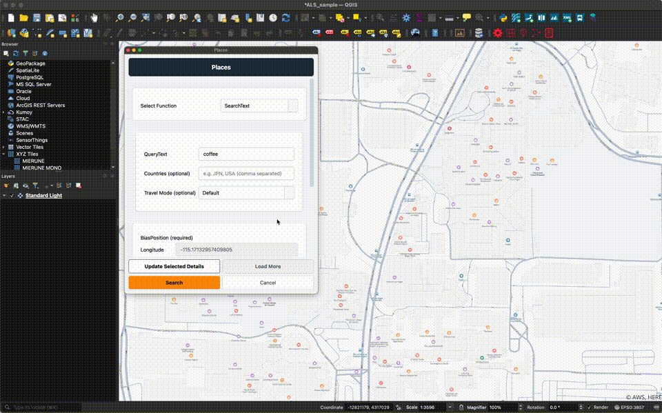

# Amazon Location Service Plugin

Read this in other languages: [Japanese](./README_ja.md)


This plugin uses the functionality of Amazon Location Service v2 in QGIS.  

- [QGIS](https://qgis.org)  
- [Amazon Location Service](https://aws.amazon.com/location)  

## QGIS Python Plugins Repository

[Amazon Location Service Plugin](https://plugins.qgis.org/plugins/location_service)  

## Usage

### Building an Amazon Location Service API Key


[Building an Amazon Location Service v2 API Key](https://memo.dayjournal.dev/memo/amazon-location-service-007)  

### Install QGIS Plugin


1. Select `Plugins` → `Manage and Install Plugins...`
2. Search for `Amazon Location Service`

Plugins can also be installed by loading a [zip file](https://github.com/MIERUNE/qgis-amazonlocationservice-plugin/releases).

### Menu


- `Config`: Set the region and API key
- `Maps`: Map display function
- `Places`: Search and geocoding functions
- `Routes`: Routing function
- `Terms`: Display Terms of Use page

### Config Function


1. Click the `Config` menu
2. Set the region and API key
    - `Region`: an AWS region code such as `ap-northeast-1`
    - `API Key`: `v1.public.xxxxx`
3. Click `Save`

### Maps Function


1. Click the `Maps` menu
2. Select a `Style` (Standard / Monochrome / Hybrid / Satellite)
3. Choose a `Color Scheme` (Light / Dark)
4. (Optional) Configure style descriptor options:
    - `Language`: label language for place names
    - `Political View`: country-specific border representation
    - `Terrain`: Hillshade overlay
    - `Contour Density`: Low / Medium / High
    - `Traffic`: All / Congestion
    - `Travel Modes`: Transit / Truck
5. Click `Add`
6. The basemap is displayed as a layer

#### API key handling

- Map tile requests go through the plugin's proxy rather than directly to AWS. Each request includes the configured API key.
- The Maps layer source URI contains the API key. Saving the QGIS project stores the key as plain text in the project file.

※ As of August 2026, `Buildings3D` and `Terrain3D` are not supported.

### Places Function



1. Click the `Places` menu
2. Choose a function in `Select Function`
3. Fill in the parameters of the selected function
4. (Optional or required) Click `Get Location` and click a point on the map
5. Click the search button
6. Results are added as layers, and the dialog stays open so you can run another operation

Available functions:

- `SearchText`: Searches for places by free text. A bias position is required. It also supports a `Countries` filter and `Travel Mode` (Car / Scooter / Truck).
- `Geocode`: Converts an address into coordinates. Optional bias position, `Countries` filter, `Address Names` mode, and `Postal Code Mode`.
- `ReverseGeocode`: Converts a clicked position into the nearest address(es). Requires a position; optional `QueryRadius` in meters (0 = unset).
- `SearchNearby`: Searches for points of interest around a clicked position. Requires a position and a `QueryRadius` in meters.

※ As of August 2026, `Suggest` and `Autocomplete` are not supported.

### Routes Function


1. Click the `Routes` menu
2. Choose a function in `Select Function`
3. Fill in the parameters of the selected function
4. (Optional or required) Click `Get Location` and click a point on the map
5. Click the run button
6. Results are added as layers, and the dialog stays open so you can run another operation

Available functions:

- `CalculateRoutes`: Calculates a route between a start and end point. Supports waypoints, `Travel Mode`, `Optimize For`, `Avoid`, and a departure or arrival time.
- `CalculateIsolines`: Calculates the area reachable within a time or distance from a specified point. Supports direction, `Travel Mode`, and up to five thresholds.
- `SnapToRoads`: Snaps a GPS trace from a point or multipoint layer to roads. Supports `Timestamp` / `Heading` / `Speed` fields and `Snap Radius`.
- `CalculateRouteMatrix`: Calculates distances and durations in bulk between two point layers. Results are output as a table, with optional straight OD lines.

※ As of August 2026, `OptimizeWaypoints` is not supported.

### Terms Function

1. Click the `Terms` menu
2. The Terms of Use page will be displayed in your browser.

### Terms

[AWS Service Terms](https://aws.amazon.com/jp/service-terms)

Amazon Location Service has terms of use for data usage. Please check the section “82. Amazon Location Service” and use the service at your own risk. The developer is not responsible for any damages that may occur in connection with the use of this service.  

When using HERE as a provider, in addition to the basic terms and conditions, you may not.  

a. Store or cache any Location Data for Japan, including any geocoding or reverse-geocoding results.  
b. Layer routes from HERE on top of a map from another third-party provider, or layer routes from another third-party provider on top of maps from HERE.  

## Development

### Requirements

- [uv](https://docs.astral.sh/uv/)
- QGIS 3.34 or later (including QGIS 4.x)

### Setup

```bash
# Install dependencies
uv sync

# Lint
uv run ruff check .

# Format
uv run ruff format .
```

### Local Development

Create a symbolic link to the QGIS plugins directory:

**macOS:**
```bash
ln -s /path/to/location_service ~/Library/Application\ Support/QGIS/QGIS3/profiles/default/python/plugins/location_service
```

**Windows:**
```powershell
mklink /D "%APPDATA%\QGIS\QGIS3\profiles\default\python\plugins\location_service" "C:\path\to\location_service"
```

**Linux:**
```bash
ln -s /path/to/location_service ~/.local/share/QGIS/QGIS3/profiles/default/python/plugins/location_service
```

For QGIS 4, replace `QGIS3` with `QGIS4` in the profile path.

After editing the code, reload the plugin in QGIS to see the changes.

## License

Python modules are released under the GNU General Public License v2.0

Copyright (c) 2024-2026 MIERUNE Inc.
