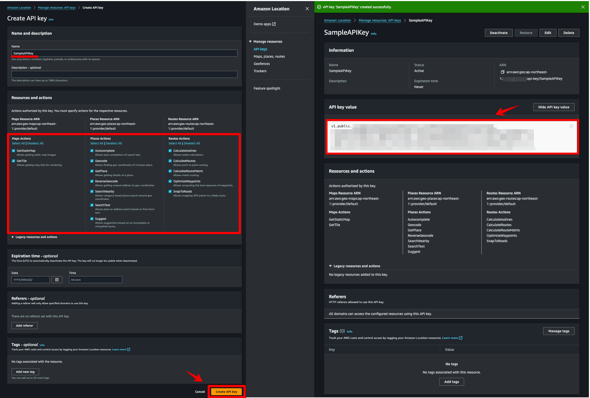
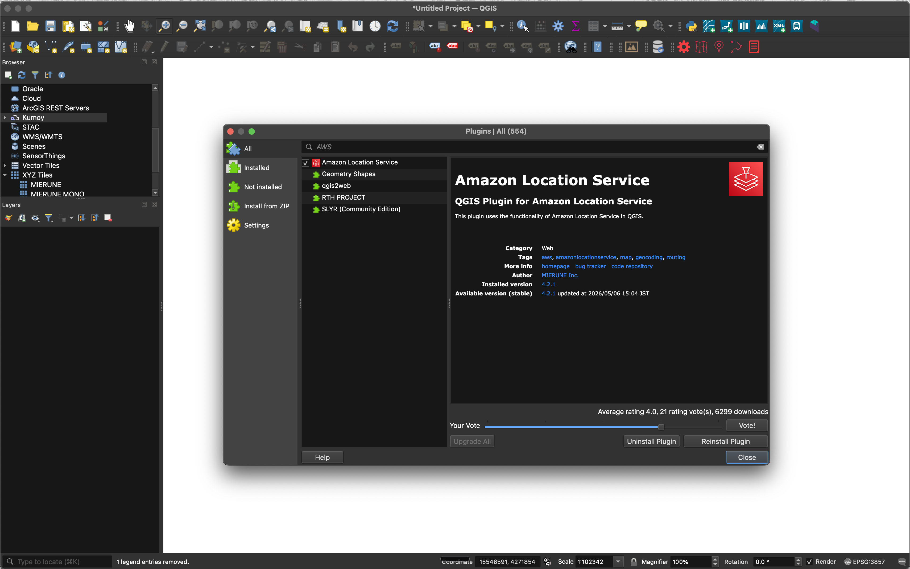
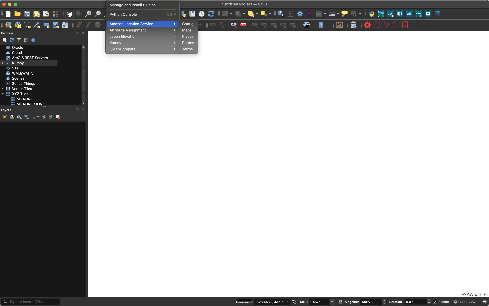
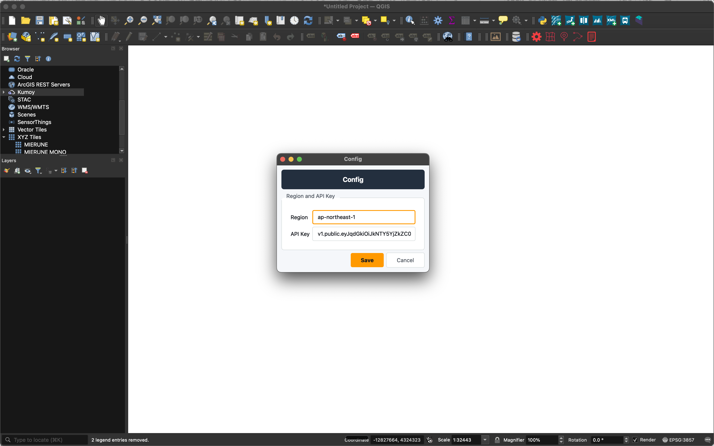
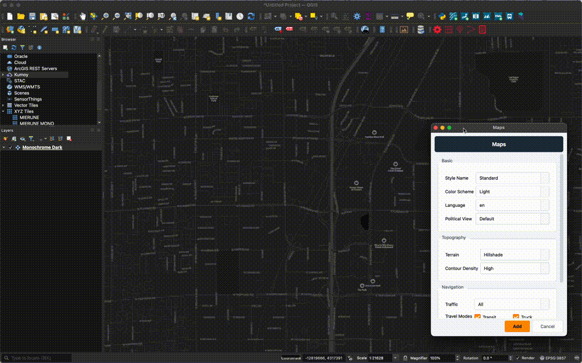
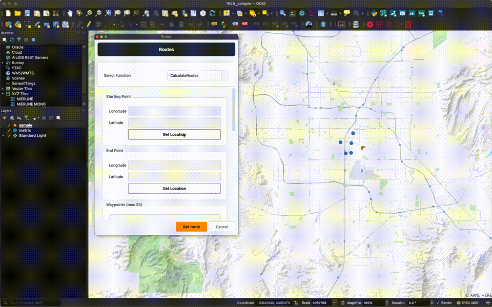

# Amazon Location Service Plugin

他の言語で読む: [英語](./README.md)


QGISでAmazon Location Service v2の機能を利用するプラグインです。  

- [QGIS](https://qgis.org)  
- [Amazon Location Service](https://aws.amazon.com/location)  

## QGIS Python Plugins Repository

[Amazon Location Service Plugin](https://plugins.qgis.org/plugins/location_service)  

## 利用方法

### Amazon Location ServiceのAPIキー作成



[Amazon Location Service v2のAPIキー作成](https://memo.dayjournal.dev/memo/amazon-location-service-007)  

### QGIS Pluginのインストール



1. `プラグイン` → `プラグインを管理およびインストール`を選択
2. `Amazon Location Service`で検索

プラグインは[zipファイル](https://github.com/MIERUNE/qgis-amazonlocationservice-plugin/releases)を読み込みでもインストール可能

### メニュー



- `Config`: リージョン名とAPIキーを設定
- `Maps`: 地図表示機能
- `Places`: 検索・ジオコーディング機能
- `Routes`: ルーティング機能
- `Terms`: 利用規約ページを表示

### 設定



1. `Config`メニューをクリック
2. リージョン名とAPIキーを設定
    - `Region`: `ap-northeast-1`のようなAWSリージョンコード
    - `API Key`: `v1.public.xxxxx`
3. `Save`をクリック

### Maps機能



1. `Maps`メニューをクリック
2. `Style`を選択（Standard / Monochrome / Hybrid / Satellite）
3. `Color Scheme`を選択（Light / Dark）
4. （任意）スタイル詳細オプションを設定
    - `Language`: 地名ラベルの言語
    - `Political View`: 国境表示の地政学的視点
    - `Terrain`: 陰影起伏の重ね合わせ
    - `Contour Density`: 等高線の密度（Low / Medium / High）
    - `Traffic`: 交通情報（All / Congestion）
    - `Travel Modes`: 交通手段（Transit / Truck）
5. `Add`をクリック
6. 背景地図がレイヤで表示

#### APIキーの取り扱い

- 地図タイルのリクエストはAWSへ直接送信されず、このプラグインのプロキシを経由します。各リクエストに設定したAPIキーが含まれます。
- MapsレイヤのソースURIにはAPIキーが含まれます。QGISプロジェクトを保存すると、プロジェクトファイルにAPIキーが平文で保存されます。

※ 2026.08現在、`Buildings3D`と`Terrain3D`は未対応

### Places機能

1. `Places`メニューをクリック
2. `Select Function`で機能を選択
3. 選択した機能のパラメータを入力
4. （任意または必須）`Get Location`をクリックし、地図上の位置をクリック
5. 検索ボタンをクリック
6. 検索結果がポイントレイヤで追加され、ダイアログは開いたまま続けて検索可能

利用できる機能:

- `SearchText`: フリーテキストで場所を検索。バイアス位置は必須。`Countries`フィルタと`Travel Mode`（Car / Scooter / Truck）に対応。
- `Geocode`: 住所を座標に変換。バイアス位置（任意）、`Countries`フィルタ、`Address Names`モード、`Postal Code Mode`に対応。
- `ReverseGeocode`: クリックした位置を最寄りの住所に変換。位置は必須。`QueryRadius`（メートル、0 = 未指定）は任意。
- `SearchNearby`: クリックした位置の周辺スポットを検索。位置と`QueryRadius`（メートル）が必須。

※ 2026.08現在、`Suggest`と`Autocomplete`は未対応

### Routes機能



1. `Routes`メニューをクリック
2. `Select Function`を選択
3. `Get Location(Starting Point)`をクリック
4. 始点をクリック
5. `Get Location(End Point)`をクリック
6. 終点をクリック
7. `Search`をクリック
8. 検索結果がレイヤで表示

※ 2025.01現在、`CalculateRoutes`が利用可能

### Terms機能

1. `Terms`メニューをクリック
2. 利用規約ページがブラウザで表示

### 利用規約

[AWS Service Terms](https://aws.amazon.com/jp/service-terms)

Amazon Location Serviceにはデータ利用について利用規約があります。「82. Amazon Location Serviceプレビュー」の項目を確認し、自己責任でご利用ください。開発者は、本サービスの利用に関して発生するいかなる損害についても一切の責任を負いません。  

HEREをプロバイダとして使用する場合、基本的な利用規約に加えて、次のことを行うことはできません。  

a. ジオコード化および逆ジオコード化の結果を含む日本のロケーションデータを保管またはキャッシュすること。  
b. 別の第三者プロバイダからのマップの上にHEREのルートを重ねること、またはHEREのマップ上に他の第三者プロバイダからのルートを重ねること。  

## 開発

### 必要なツール

- [uv](https://docs.astral.sh/uv/)
- QGIS 3.34以降（QGIS 4.xを含む）

### セットアップ

```bash
# 依存関係のインストール
uv sync

# リント
uv run ruff check .

# フォーマット
uv run ruff format .
```

### ローカル開発

QGISのプラグインディレクトリにシンボリックリンクを作成します：

**macOS:**
```bash
ln -s /path/to/location_service ~/Library/Application\ Support/QGIS/QGIS3/profiles/default/python/plugins/location_service
```

**Windows:**
```powershell
mklink /D "%APPDATA%\QGIS\QGIS3\profiles\default\python\plugins\location_service" "C:\path\to\location_service"
```

**Linux:**
```bash
ln -s /path/to/location_service ~/.local/share/QGIS/QGIS3/profiles/default/python/plugins/location_service
```

QGIS 4を使用する場合は、プロファイルパスの`QGIS3`を`QGIS4`に置き換えてください。

コードを編集した後、QGISでプラグインをリロードすると変更が反映されます。

## ライセンス

Python modules are released under the GNU General Public License v2.0

Copyright (c) 2024-2026 MIERUNE Inc.
